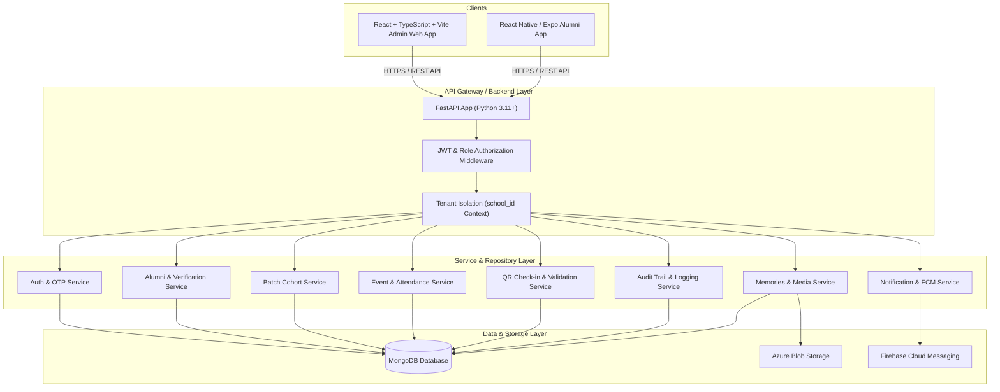

# System Architecture: School Alumni & Get-Together Platform

## 1. Overview
The School Alumni Management & Get-Together Platform is a B2B SaaS-ready application designed for private schools to connect alumni, manage batch cohorts, organize get-together reunions, handle secure QR check-ins, share memories, and broadcast announcements.

While the initial deployment targets **one primary school** (e.g., ABC School with cohorts from 2005 to 2025+), every entity in the database incorporates a `school_id` to guarantee strict multi-tenant data isolation for future SaaS expansion.

---

## 2. High-Level System Architecture Diagram

---

## 3. Tech Stack Specifications

### 3.1 Backend
- **Framework**: FastAPI (Python 3.11+)
- **Async DB Driver**: Motor (AsyncIO MongoDB driver)
- **Data Validation & Schemas**: Pydantic v2
- **Authentication**: JWT (Access Token + Refresh Token), Passlib/Bcrypt, OTP validation
- **Cloud Storage**: Azure Blob Storage SDK (`azure-storage-blob`) with local mock fallback for development
- **Notifications**: PyFCM / Firebase Admin SDK integration

### 3.2 Frontend Web Admin
- **Framework**: React 18+, TypeScript, Vite
- **Styling**: Tailwind CSS with custom design system tokens (#FFFFFF canvas, #111111 typography, #F4C542 primary yellow, #FFF7D6 soft yellow)
- **Routing**: React Router v6
- **State Management**: TanStack Query (React Query v5) for server state, Lucide React icons

### 3.3 Mobile Alumni App
- **Framework**: React Native with Expo (SDK 51+), TypeScript
- **Navigation**: Expo Router / React Navigation
- **UI Components**: Lightweight custom component system based on design tokens
- **Features**: Camera QR scanner, Image picker, Push notification client

---

## 4. Multi-Tenant Data Isolation Pattern
Every request from an authenticated user extracts the user's `school_id` from their cryptographically verified JWT session. 
- API endpoints never accept an untrusted `school_id` in request query or body parameters for tenant verification.
- MongoDB queries automatically append `{"school_id": user.school_id}` to prevent cross-tenant data leakage.
