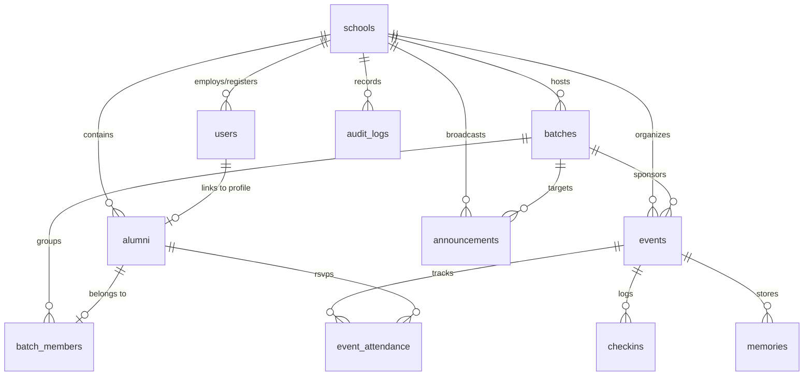

# Database Architecture & MongoDB Schemas

## 1. Overview
The database uses MongoDB for flexibility, high read throughput, and clean JSON document representations. Every document owned by a school includes a `school_id` field indexed for query isolation.

---

## 2. Collection Relationship Diagram



---

## 3. Detailed Collection Schemas

### 3.1 `schools`
```json
{
  "_id": "ObjectId",
  "name": "ABC School",
  "code": "ABC",
  "logo_url": "https://...",
  "cover_url": "https://...",
  "description": "Excellence in Education since 1985",
  "address": "123 Education Lane, Chennai, TN",
  "website": "https://abcschool.edu",
  "contact_phone": "+919876543210",
  "contact_email": "alumni@abcschool.edu",
  "established_year": 1985,
  "status": "ACTIVE",
  "created_at": "ISODate",
  "updated_at": "ISODate"
}
```

### 3.2 `users`
```json
{
  "_id": "ObjectId",
  "school_id": "ObjectId",
  "mobile": "+919876543210",
  "email": "arun@example.com",
  "hashed_password": "string (optional for OTP auth)",
  "roles": ["ALUMNI"], // SCHOOL_ADMIN, BATCH_COORDINATOR, ALUMNI
  "is_active": true,
  "last_login_at": "ISODate",
  "created_at": "ISODate"
}
```

### 3.3 `alumni`
```json
{
  "_id": "ObjectId",
  "school_id": "ObjectId",
  "user_id": "ObjectId",
  "full_name": "Arun Kumar",
  "mobile": "+919876543210",
  "email": "arun@example.com",
  "profile_photo_url": "https://...",
  "passing_year": 2010,
  "batch_id": "ObjectId",
  "admission_number": "ABC-2010-042",
  "section": "A",
  "current_city": "Chennai",
  "profession": "Software Architect",
  "verification_status": "APPROVED", // PENDING, APPROVED, REJECTED, SUSPENDED
  "verification_notes": "Verified against school records",
  "verified_by": "ObjectId",
  "verified_at": "ISODate",
  "email_visible": false,
  "created_at": "ISODate"
}
```

### 3.4 `batches`
```json
{
  "_id": "ObjectId",
  "school_id": "ObjectId",
  "name": "Class of 2010",
  "passing_year": 2010,
  "description": "The Silver Jubilee Batch of ABC School",
  "coordinators": ["ObjectId (alumni_id)"],
  "status": "ACTIVE", // ACTIVE, ARCHIVED
  "created_at": "ISODate"
}
```

### 3.5 `events`
```json
{
  "_id": "ObjectId",
  "school_id": "ObjectId",
  "batch_id": "ObjectId (optional, null if school-wide)",
  "title": "2010 Grand Reunion",
  "description": "Celebrating 16 years of memories!",
  "event_date": "2026-12-20",
  "start_time": "10:00 AM",
  "end_time": "05:00 PM",
  "venue": "Grand Ballroom, Hotel Taj Connemara",
  "address": "Binny Road, Chennai, Tamil Nadu",
  "map_coordinates": {"lat": 13.0604, "lng": 80.2496},
  "registration_deadline": "2026-12-15T23:59:59Z",
  "guest_allowed": true,
  "max_capacity": 300,
  "status": "PUBLISHED", // DRAFT, PUBLISHED, CANCELLED, COMPLETED
  "qr_secret_key": "string",
  "created_by": "ObjectId",
  "created_at": "ISODate"
}
```

### 3.6 `event_attendance`
```json
{
  "_id": "ObjectId",
  "school_id": "ObjectId",
  "event_id": "ObjectId",
  "alumni_id": "ObjectId",
  "rsvp_status": "ATTENDING", // ATTENDING, MAYBE, DECLINED
  "adults_count": 2,
  "children_count": 1,
  "total_guests": 3,
  "qr_token": "string",
  "updated_at": "ISODate"
}
```

### 3.7 `checkins`
```json
{
  "_id": "ObjectId",
  "school_id": "ObjectId",
  "event_id": "ObjectId",
  "alumni_id": "ObjectId",
  "checked_in_by": "ObjectId",
  "checked_in_at": "ISODate",
  "method": "QR_SCAN" // QR_SCAN, MANUAL
}
```

### 3.8 `announcements`
```json
{
  "_id": "ObjectId",
  "school_id": "ObjectId",
  "batch_id": "ObjectId (optional)",
  "target": "BATCH", // SCHOOL, BATCH
  "title": "Annual Alumni Meet 2026",
  "content": "Registration is officially open for all alumni.",
  "created_by": "ObjectId",
  "created_at": "ISODate"
}
```

### 3.9 `memories`
```json
{
  "_id": "ObjectId",
  "school_id": "ObjectId",
  "batch_id": "ObjectId",
  "event_id": "ObjectId (optional)",
  "title": "2026 Reunion Group Photo",
  "image_url": "https://...",
  "thumbnail_url": "https://...",
  "blob_path": "memories/2010/photo1.jpg",
  "uploaded_by": "ObjectId",
  "status": "APPROVED", // PENDING, APPROVED, HIDDEN
  "created_at": "ISODate"
}
```

### 3.10 `audit_logs`
```json
{
  "_id": "ObjectId",
  "school_id": "ObjectId",
  "user_id": "ObjectId",
  "action": "ALUMNI_VERIFIED",
  "resource_type": "alumni",
  "resource_id": "ObjectId",
  "metadata": {"previous_status": "PENDING", "new_status": "APPROVED"},
  "timestamp": "ISODate"
}
```

---

## 4. Database Indexes
1. `users`: `{ mobile: 1 }`, `{ email: 1 }`
2. `alumni`: `{ school_id: 1, batch_id: 1 }`, `{ school_id: 1, verification_status: 1 }`
3. `batches`: `{ school_id: 1, passing_year: 1 }`
4. `events`: `{ school_id: 1, event_date: 1 }`, `{ school_id: 1, batch_id: 1 }`
5. `event_attendance`: `{ event_id: 1, alumni_id: 1 }` (unique compound index)
6. `checkins`: `{ event_id: 1, alumni_id: 1 }` (unique compound index to prevent duplicate check-ins)
7. `memories`: `{ school_id: 1, batch_id: 1, event_id: 1 }`
