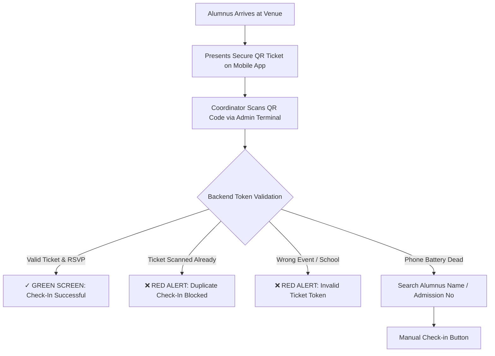

# Event-Day On-Site Operational Guide & Checklist

## 1. Overview
This operational guide provides step-by-step instructions for **School Admins** and **Batch Coordinators** managing on-site venue check-in during get-together reunions for **ABC School**.

---

## 2. Pre-Event Readiness Checklist (T-24 Hours)

- [ ] **Network Connectivity Verified**: Confirm venue Wi-Fi and mobile 4G/5G data connectivity.
- [ ] **Scanner Station Charged**: Verify tablets/laptops and mobile devices running the QR Scanner Terminal are 100% charged with power banks available.
- [ ] **Coordinator Accounts Ready**: Verify assigned Batch Coordinators can sign in to Admin Web (`http://admin.abcschool.edu`) or Mobile App.
- [ ] **Event Published & Capacity Locked**: Confirm event status is `PUBLISHED` and registration deadline is enforced.
- [ ] **Test Ticket Scan Executed**: Scan a sample test ticket to verify instant green **CHECK-IN SUCCESSFUL** notification and audio cue.

---

## 3. On-Site Check-In Station Execution Workflow

---

## 4. Troubleshooting & Contingency Protocols

### Scenario A: Alumnus Phone Battery Died / No Ticket Display
1. On the QR Check-in Terminal screen, open **Manual Attendee Lookup**.
2. Search alumnus full name or admission number.
3. Confirm identity against photo/ID card and click **Check In**.

### Scenario B: Temporary Venue Internet Outage
1. Check-in Terminal will display **OFFLINE** status banner.
2. Coordinators switch to Manual Lookup list mode or queue check-ins on mobile data hotspot.
3. When network reconnects, background sync flushes queued check-in timestamps.

---

## 5. Post-Event Wrap-Up Checklist

- [ ] **Export Attendance CSV**: Navigate to **Events -> Event Details -> Export Attendance CSV** to download complete roster with exact check-in timestamps.
- [ ] **Mark Event Completed**: Change event status from `PUBLISHED` to `COMPLETED`.
- [ ] **Enable Memory Photo Uploads**: Broadcast announcement encouraging attendees to upload reunion photos.
