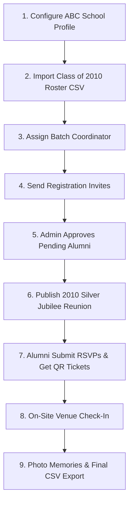

# Real-School Pilot Guide: ABC School (Class of 2010)

## 1. Pilot Scope & Objectives
The goal of the Phase 2 Pilot is to run a real-world alumni get-together reunion for **ABC School Class of 2010 cohort** (150 alumni target).

### Success Criteria:
1. Real ABC School metadata, logo, and cover configured.
2. 150 alumni roster records imported safely via CSV with 0 undetected duplicates.
3. Batch Coordinator assigned and able to publish reunion event.
4. Alumni register, get verified, submit RSVPs with guest counts, and receive encrypted QR entry tickets.
5. On-site QR check-in scans 100+ attendees at venue with zero system crashes.
6. Alumni upload reunion memory photos and admin moderates gallery.
7. Post-event attendance CSV exported cleanly.

---

## 2. Step-by-Step Pilot Onboarding Flow



---

## 3. Pilot Invitation Template (WhatsApp / Email)

```text
Dear ABC School 2010 Batchmate,

We are excited to launch the official ABC School Alumni Portal! 

Please register your alumni profile to join our Class of 2010 Silver Jubilee Reunion:
👉 Link: https://alumni.abcschool.edu

Once registered, you can view fellow batchmates, RSVP for our upcoming get-together at Hotel Taj Connemara, and receive your digital QR entry ticket.

Warm regards,
ABC School Alumni Association
```

---

## 4. Pilot Feedback Collection Mechanism
Alumni can submit lightweight feedback directly inside the Mobile App (`Settings -> Feedback`):
- Rating: 1 to 5 Stars
- Optional Comment
- Context Tag: Registration / Event RSVP / QR Ticket / Photo Gallery

Admin reviews feedback under **Admin Portal -> System Reports & Feedback**.
