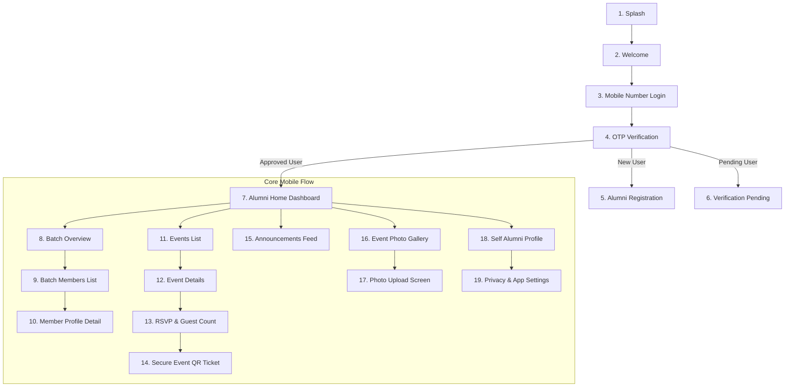
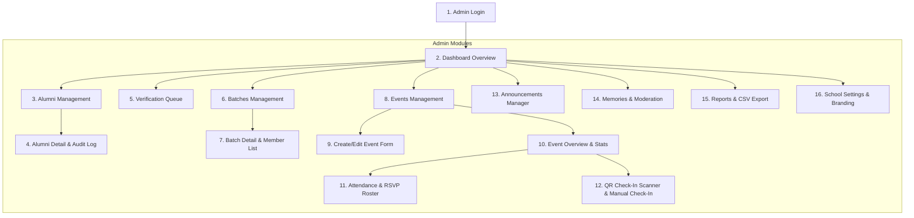

# Admin & Mobile Screen Maps

## 1. Mobile Alumni App Screen Map (19 Screens)

### Mobile Screen Responsibilities
1. **Splash**: Initial branding & session auto-token check.
2. **Welcome**: School branding highlight & quick login CTA.
3. **Login**: Mobile number input with auto-formatting & country code (+91).
4. **OTP**: 6-digit pin code entry with auto-focus & resend countdown timer.
5. **Registration**: Full name, email, profile photo, batch selection, admission number, section, city, profession.
6. **Verification Pending**: Status card explaining admin review with refreshing status button.
7. **Home**: Personal greeting, batch badge, upcoming event hero card with attendee count & RSVP CTA, latest announcement, recent memory photos.
8. **Batch**: Cohort details, total alumni count, tab navigation (Members, Events, Announcements, Memories).
9. **Batch Members**: Grid/List of verified batchmates with search & filter.
10. **Member Profile**: Verified alumni avatar, name, batch, city, profession, email (if privacy allowed).
11. **Events**: Upcoming & past get-togethers tabbed list.
12. **Event Details**: Title, date/time, venue address, interactive map link, description, RSVP status, guest capacity.
13. **Attendance**: Adult guest count stepper, child guest count stepper, total RSVP confirmation.
14. **QR Ticket**: Secure encrypted token QR display for venue entrance scanning.
15. **Announcements**: Card feed for school-wide and batch notifications.
16. **Memories**: Grid of event photos grouped by reunion/album with lazy loading.
17. **Photo Upload**: Image picker, caption input, event selector, upload progress indicator.
18. **Profile**: Editable profile photo, contact details, profession, city.
19. **Settings**: Email visibility toggle, notifications preferences, logout button.

---

## 2. Web Admin App Screen Map (16 Screens)

### Admin Screen Responsibilities
1. **Admin Login**: Secure login with mobile/password or OTP.
2. **Dashboard**: Metrics widgets (Total Alumni, Verified, Pending, Active Batches, Upcoming Reunion), quick action links, pending approval queue preview.
3. **Alumni**: Data table of all alumni, batch filters, status filters, search bar, status toggle, export buttons.
4. **Alumni Details**: Full applicant info, verification history, assigned batch, activity log.
5. **Verification Queue**: Pending registration applications side-by-side review, CSV roster match helper, Approve/Reject/Request Info modals.
6. **Batches**: Grid of batch cohorts, coordinator assignments, passing year tags, quick member counts.
7. **Batch Details**: Cohort info, list of members, assigned coordinators picker, cohort events & memories.
8. **Events**: Table of all reunions (School-wide & Batch), draft/published/completed filters, quick stats.
9. **Create Event Form**: Step-by-step form for event title, batch target, date/time, venue address, guest policy, capacity limit, description.
10. **Event Details**: Real-time RSVP summary counters (Confirmed, Maybe, Declined, Guests, Total Expected).
11. **Attendance Roster**: List of attendees with adult/kid count breakdown, check-in status, CSV export button.
12. **QR Check-in Scanner**: Integrated webcam/device QR scanner, search fallback, instant verification green screen & audio cue.
13. **Announcements Manager**: Broadcast message compose box (School-wide or Batch targeted), historical announcements list.
14. **Memories & Moderation**: Grid of uploaded photos with one-click hide/delete moderation and album grouping.
15. **Reports & CSV Export**: Chart visualizations of alumni growth, batch breakdown, event turnout rates, CSV downloads.
16. **School Settings**: School name, established year, address, logo/cover image uploader, contact info.
